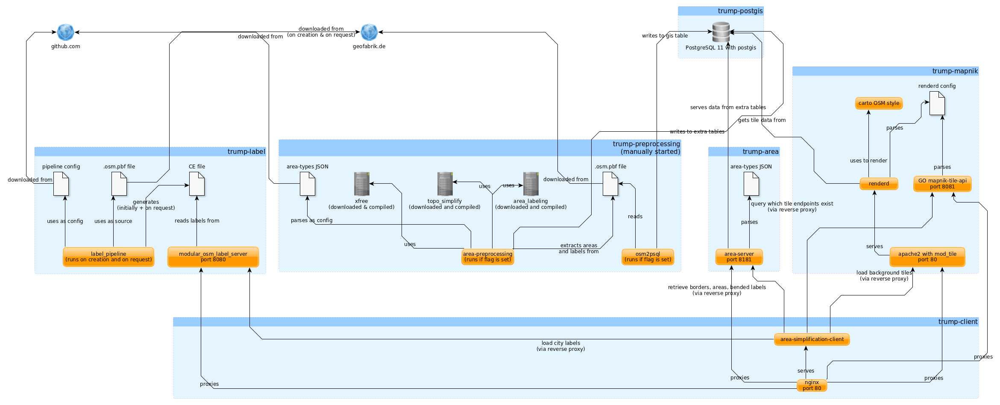

# trump-docker 

This repository contains Docker images and a Docker compose file for the [TRUMP project](http://seeigel.informatik.uni-stuttgart.de).

## docker-compose

All Images can be found on [Docker hub](https://hub.docker.com/u/slothofanarchy) so you can just pull them with `docker-compose pull` and start everything with `docker-compose up`.
If you want to build the images by yourself, use `docker-compose up --build`.

Some containers can be configured by editing the respective `env` file in its folder.

docker-compose starts all images except for `trump-preprocessing`, which should only be run manually to update the database contents ([see below](#trump-preprocessing)).

## Architecture

## Images

The project consists of six images, some of them depending on each other.

### trump-postgis

This image runs a postgresql database with the postgis extension to store the OSM data for Mapnik and the area server.
A volume is used to store the postgres data persistently.

### trump-preprocessing

This image is used to download and import OSM data into the postgres database as well as [preprocess](https://github.com/trump-fmi/area-preprocessing) data for the area Container.
Dependencies for preprocessing will be compiled on each run.
Assuming the docker-compose network with its containers is running, this container can be started using `docker run --network=trump-docker_default --env-file=./preprocessing/env -it slothofanarchy/trump-preprocessing:latest`.
The [env file](preprocessing/env) for this Image contains the URL of the OSM source file (`OSM_INPUT_URL`) as well as flags to enable importing data and/or preprocessing data.
The default is to only run preprocessing.

### trump-mapnik

This is an image running Mapnik with apache2 and [openstreetmap-carto](https://github.com/gravitystorm/openstreetmap-carto).
It sources its OSM data from the postgis container.
It also serves the [mapnik-tile-api](https://travis-ci.org/trump-fmi/mapnik-tile-api).

### trump-label

This image runs the [modular_osm_label_server](https://github.com/trump-fmi/modular_osm_label_server), which gets its data from the [label_pipeline](https://github.com/trump-fmi/label_pipeline).
The source URL is set in the [label/env](label/env) file.
The download and conversion process may later be repeated by running `docker exec -it <container name or ID> update-labels`.

### trump-area

This image serves the [area-server](https://github.com/trump-fmi/area-server), which gets its data from the postgis container.
The [area-types](https://github.com/trump-fmi/area-types) repository is included.

### trump-client

This image serves the [area-simplification-client](https://github.com/trump-fmi/area-simplification-client) via nginx and acts as an reverse proxy to the APIs of other containers.
In its [env file](client/env), the URIs for the reverse proxied upstreams can be configured, defaulting to the APIs provided by the other containers.

## systemd

If you clone this repository to `/opt/trump-docker`, you may use the provided [systemd service](trump.service) to run the project.
There is also a [service](docker-pull.service) and corresponding minutely [timer](docker-pull.timer) to update the containers if some images changed upstream.
